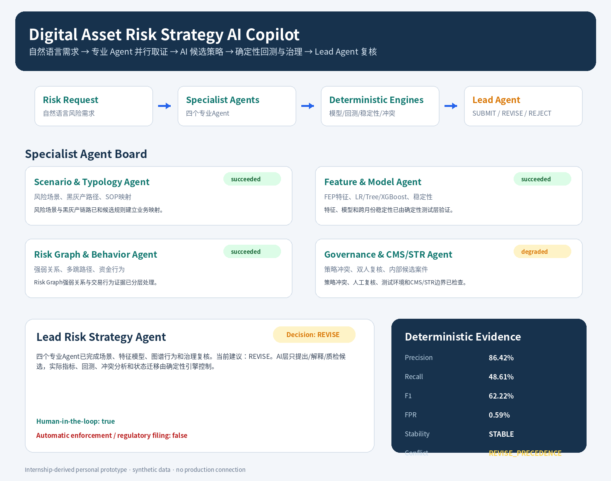

# Digital Asset Risk Strategy AI Copilot

> **Internship-derived personal prototype.** Built from the product structures, SOPs and desensitized field semantics learned during a digital-asset risk/compliance internship. The repository uses synthetic data, has no production connection, and does not claim that the prototype was deployed at CoinTR.

This project turns the internship’s Rule Engine, FEP feature platform, strategy backtracking, Risk Graph, user-risk scoring, Ticket Module and CMS/STR product concepts into a **financial-advisor-style multi-Agent system**.

The design deliberately separates two responsibilities:

- **AI Agents** understand a natural-language risk request, retrieve internal SOP/product knowledge, propose candidate strategies, inspect graph and behavior evidence, critique model results and synthesize a review memo.
- **Deterministic risk engines** own feature contracts, Train/Development/OOT separation, model fitting, rule execution, stability/conflict metrics, lifecycle transitions and audit records.

An Agent can recommend or explain. It cannot silently modify production state, execute punishment or submit a regulatory report.



## 1. AI Agent architecture

The default mode is offline and reproducible; the same specialist roles can optionally be backed by LangGraph ReAct Agents and an OpenAI-compatible model.

```text
Natural-language risk request
        ↓
Intent Router Agent
        ↓
┌───────────────────────────────────────────────┐
│ Scenario & Typology Agent                     │
│ Feature & Model Agent                         │
│ Risk Graph & Behavior Agent                   │
│ Governance & CMS/STR Agent                    │
└───────────────────────────────────────────────┘
        ↓ parallel evidence gathering
AI Strategy Proposal Agent
        ↓
Candidate Strategy Generator
        ↓
Deterministic Backtest / Stability / Conflict Engines
        ↓
Lead Risk Strategy Agent
        ↓
Simulation package + independent-review memo
```

### Specialist Agent mapping

| Agent | CoinTR-derived responsibility | Main tools/evidence |
|---|---|---|
| Scenario & Typology Agent | Risk domain, attack chain, black/grey-industry behavior, SOP alignment | Hybrid SOP/typology retrieval, event catalog |
| Feature & Model Agent | FEP fields, decision-time availability, AUC/KS/IV/Lift/PSI, LR/Tree/XGBoost | Feature catalog, model benchmark, stability tool |
| Risk Graph & Behavior Agent | One/two-hop relations, shared device/address evidence, rapid fund movement | Graph explanation, behavior contrast |
| Governance & CMS/STR Agent | Strategy overlap, action precedence, simulation, second review, internal case preview | Conflict analysis, test environment, CMS/STR preview |
| Lead Risk Strategy Agent | Preserves disagreements and recommends `SUBMIT`, `REVISE` or `REJECT_AS_DUPLICATE` | Four specialist reviews and deterministic evidence |

### ReAct/MCP mode

`src/risk_copilot/react_app.py` implements four parallel LangGraph ReAct Agents. They can dynamically call read-only tools for:

- feature and event-contract retrieval;
- SOP and fraud-typology search;
- product capability mapping;
- graph-path explanation;
- cross-month/bootstrap stability;
- strategy conflict and incremental-value analysis;
- company-style test environment;
- CMS/STR internal candidate-case preview;
- version and audit history.

The MCP server exposes the same governed tool layer. Optional live mode requires `.[agent]` dependencies and an OpenAI-compatible API. Without an API key, the deterministic multi-Agent board remains fully runnable.

## 2. Company-style strategy test platform

```text
Risk request / historical black samples
→ event and FEP feature-contract validation
→ expert / AI-planned / decision-tree / XGBoost / graph candidates
→ Train → Development → OOT evaluation
→ SIMULATION
→ independent second review
→ release-readiness package
→ blank three-working-day observation template
→ effectiveness ticket
→ weekly/monthly retain, tune, pause or retire decision
```

### Rule Engine and three-level tags

Each candidate contains:

- `event_code`;
- level-1 risk domain, level-2 scenario and level-3 action/integration tag;
- Rule DSL, thresholds and required features;
- action proposal and approval requirements;
- event-contract version/hash, data snapshot and feature-catalog version;
- version, payload hash and audit history.

### FEP-style feature governance

- only registered, decision-time-available features may enter a strategy;
- real-time, H+1, T+1 and offline semantics are recorded;
- missingness, quantiles, AUC, KS, IV, Lift, PSI and feature direction are profiled;
- point-in-time checks prevent future fields from entering an earlier decision;
- long-window counters model the internship’s 180-day counter concept.

## 3. P0 enhancements

### P0-A: Interactive strategy console

Start the API and open `/console`:

```bash
risk-copilot serve --host 127.0.0.1 --port 8000
# http://127.0.0.1:8000/console
```

The console accepts a natural-language risk requirement and displays:

- specialist Agent and Lead Agent conclusions;
- selected Rule DSL and OOT metrics;
- stability and portfolio conflict results;
- governance/test-environment stage;
- effectiveness-ticket and CMS/STR internal preview.

### P0-B: Strategy conflict and incremental contribution

The selected strategy is compared with a synthetic existing portfolio using:

- alert overlap and Jaccard similarity;
- selected/existing containment;
- duplicate operational workload;
- incremental alerts, true positives and recall contribution;
- action-precedence conflict;
- recommendations such as `ACCEPT_INCREMENTAL_VALUE`, `REVISE_ACTION_PRECEDENCE` or `REJECT_DUPLICATE`.

High overlap no longer looks like “another good rule”: it becomes a merge, precedence or rejection question.

### P0-C: Cross-month and bootstrap stability

For the frozen strategy, the system produces:

- monthly alert rate, Precision, Recall, F1 and FPR;
- coefficient of variation across months;
- 200-round bootstrap 95% intervals;
- feature-direction consistency;
- stability gates with `STABLE`, `WATCH` or `UNSTABLE` status.

These results are bound into the independent-review package and effectiveness ticket. They still do not replace real post-launch monitoring.

## 4. CMS/STR boundary

When a strategy carries the third-level tag `CMS_STR_CANDIDATE`, the prototype can create an **internal candidate case** and prefill:

- UID and event;
- strategy expression and version;
- feature snapshot;
- graph-path and risk-history summary;
- deduplication/evidence hash;
- internal status and MASAK feedback status.

Hard controls remain:

```text
human_review_required = true
external_submission_allowed = false
automatic_filing_performed = false
```

“One-click STR” therefore means internal case creation and prefill, not automatic external filing.

## 5. Technology stack

- Python, Pandas, NumPy, SciPy;
- scikit-learn and XGBoost;
- NetworkX Risk Graph;
- Pydantic schemas and Rule DSL;
- SQLite strategy/version/effectiveness registry;
- FastAPI interactive console;
- Plotly/Jinja2 reporting;
- optional LangGraph ReAct and FastMCP tool services.

## 6. Repository structure

```text
src/risk_copilot/
├── agents/                 # deterministic and AI-facing Agent nodes
├── ai/                     # candidate proposal and specialist advisory board
├── analysis/               # P0 stability and portfolio-conflict engines
├── features/               # FEP registry and feature profiling
├── models/                 # LR, Tree and XGBoost pipelines
├── graph/                  # Risk Graph enrichment and explanation
├── rules/                  # Rule DSL, candidate generation and backtest
├── governance/             # simulation, review, version and effectiveness ticket
├── integrations/           # internal CMS/STR candidate preview
├── reporting/              # Markdown/HTML/JSON/CSV artifacts
├── react_app.py            # optional live LLM/ReAct specialist board
├── mcp_server.py           # optional governed MCP tool server
├── api.py                  # FastAPI and interactive console
└── orchestrator.py         # end-to-end multi-Agent workflow
```

## 7. Run locally

```bash
python -m venv .venv
# Windows: .venv\Scripts\activate
# macOS/Linux: source .venv/bin/activate
pip install -e '.[dev]'
risk-copilot generate-data --force
risk-copilot ai-agent
risk-copilot strategy
pytest -q
```

Optional live ReAct reviewers:

```bash
pip install -e '.[agent]'
cp .env.example .env
risk-copilot ai-agent --live-react
```

## 8. Key outputs

- `outputs/index.html` — complete artifact entry point;
- `outputs/strategy_demo/strategy_dashboard.html` — strategy and AI-review dashboard;
- `outputs/strategy_demo/ai_advisory_board.md` — five-Agent advisory result;
- `outputs/strategy_demo/strategy_stability_analysis.json`;
- `outputs/strategy_demo/strategy_conflict_analysis.json`;
- `outputs/strategy_demo/strategy_test_environment.json`;
- `outputs/strategy_demo/strategy_effectiveness_ticket.json`;
- `outputs/strategy_demo/cms_str_integration.json`;
- `outputs/strategy_demo/risk_engine_payload.json`.

## 9. Project boundary and resume wording

Accurate description:

> During the internship I participated in risk-product, strategy, user-scoring, Risk Graph, CMS/STR and main-site AI capability research. After the internship, I independently reconstructed a synthetic-data Risk Strategy AI Copilot based on the desensitized product structure and SOP concepts.

Do not claim:

- production deployment at CoinTR;
- use of real customer PII or production transactions;
- automatic regulatory filing;
- that all historical team products were personally developed;
- production performance based on the synthetic metrics in this repository.

KEP regulatory-email automation and the Anti-Fraud operations metrics system are maintained as separate projects.
