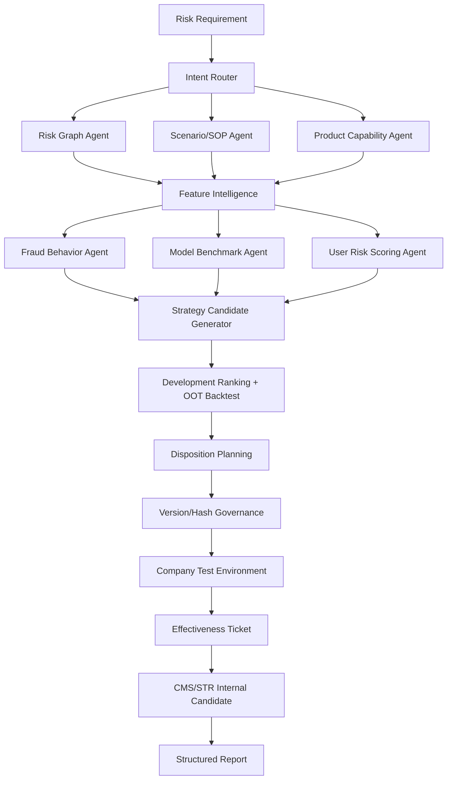

# 系统架构

## 数据层

- `events.yaml`：事件注册；
- `features.yaml`：FEP式特征目录；
- `labeling.yaml`：黑白样本、成熟时间和禁止标签；
- 合成用户、关系和事件明细。

## 决策层

- 专家规则；
- 分位阈值；
- 深度4决策树路径；
- XGBoost风险分；
- Risk Graph强关系条件；
- 多条件规则DSL。

## 治理层

- 策略版本；
- 三层标签；
- 数据快照；
- 事件契约Hash；
- Payload Hash；
- 双人复核；
- 效果工单；
- CMS/STR内部候选；
- 审计日志。
